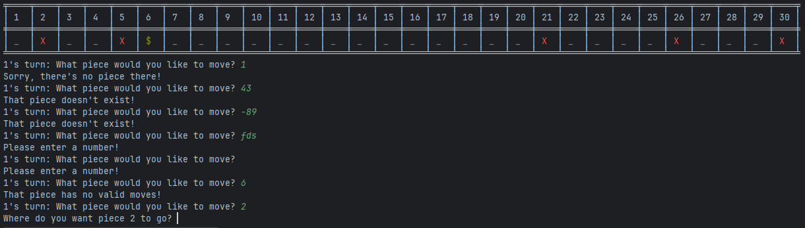
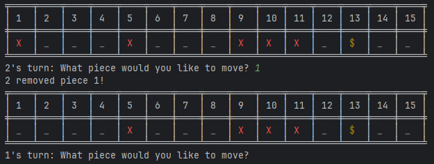
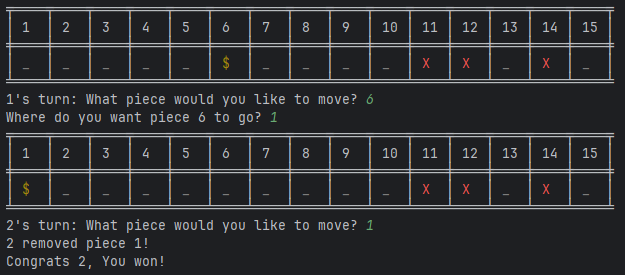

# Test Plan and Evidence / Results of Testing

## Game Description

The project involves the programming of a two-player game.

Old Gold is a simple game played on a one dimensional grid. The aim of the game is to be the player removing the gold piece.

### Game Features and Rules

The game has the following features and/or rules:

- Players can choose their own names at the start
- The size of the board can be picked from the start
- Pieces can be removed from the board once they are in the left-most position
- Pieces can only be moved left
- Pieces cannot jump over other pieces
- Players take turns moving pieces. The player can only move one piece per turn
- The player that removes the gold coin ($) wins the game

---

## Test Plan

The following game features / functionality and player actions will need to be tested:

- Valid player names
- Valid board size
- Initial board setup/generation
- Player chose a valid piece to move
- Removing pieces
- Player is moving a piece to a valid location

The following tests will be run against the completed game. The tests should result in the expected outcomes shown.

### Valid player names

This tests that players have valid names. 

#### Test Data / Actions to Use

- Enter an empty name
- Both players enter the same name
- Enter one letter
- Enter a number

#### Expected Outcome
If the names are valid, the program will move on. Valid names would be any string entered, including numbers or just one letter.
Otherwise, the program will explain what the user did wrong and repeat the request

### Valid board size

The program should check that the size of the board is between 10-30.
This is because there are six pieces on the board, so we don't want the board to be
too cluttered or too empty.

#### Test Data / Actions to Use

- Enter no board size
- Enter a board size greater than 30
- Enter 30 (Maximum allowed number)
- Enter 20
- Enter 10 (Minimum allowed number)
- Enter <10
- Enter a string of random text

#### Expected Outcome

When 30, 20 & 10 (or any number between these) are entered this should be valid board size

For all other options tried, the program should say what the user did wrong and repeat the question

### Initial board setup/generation

This is the state of the board before players have made any moves

#### Test Data / Actions to Use

- Check that the board size is what the player entered
- Rerun the code three times to check that the board is different each time

#### Expected Outcome

The board should be the size that the player entered, with 5 obstacles and 1 gold.
It should be different each game. There should only be a maximum of 1 piece in any position.
Pieces can be in any position on the board, including the edges.

### Player chose a valid piece to move

This checks that the player has selected a valid piece to move

#### Test Data / Actions to Use

- Choose an empty position
- Choose a position that is greater than the size of the board
- Choose a negative number
- Input text instead of a number
- Choose a position that contains a valid piece (X or $)
- Enter nothing
- Choose a piece that cannot be moved (Has a piece adjacent to its left)

#### Expected Outcome

If the player chose a position that contained either X or $, the position is valid and the program should move on
Otherwise the program should state the error and ask again

### Removing pieces

After ensuring that the user chose a valid piece to move, we check if they chose the left most piece.
This is because this piece cannot be moved left, instead it is removed from the board.

#### Test Data / Actions to Use

The program will remove the piece that is in the left most position on the board.

#### Expected Outcome

The piece is removed
If an obstacle (X) is removed, the game continues and the current player is switched
If the gold ($) is removed, the current player wins the game

### Player is moving a piece to a valid location

If the player is not removing a piece, they are moving a piece to a new location.
Pieces can only be moved to the left and cannot jump over other pieces

#### Test Data / Actions to Use

- Enter text instead of a new location number
- Enter the number that the piece is already in
- Enter a location that has a piece between it and the moving piece (trying to jump a piece over another one)
- Enter a number that is greater than the moving piece's location (trying to move it to the right)
- Enter a negative number
- Enter nothing
- Choose a location that the piece can actually go
- Choose the furthermost location for the piece to go
- Move it one position to the left

#### Expected Outcome

If a valid location is chosen, the selected piece should move to the new location.
Otherwise, the program will state what went wrong and repeat the question

### TEST NAME HERE

TEST DESCRIPTION HERE

#### Test Data / Actions to Use

TEST DATA TO USE DETAILED HERE

#### Expected Outcome

EXPECTED OUTCOME DETAILED HERE

---

## Evidence / Results of Testing

### Valid player names

The video below shows players choosing their names when the game starts

[Players choosing names](https://mywaimeaschool-my.sharepoint.com/:v:/g/personal/hwstringer_waimea_school_nz/EVpaGFKEThVBjV_d1Q-pAgQB7wlkc86o40E4By4coCxvrg?e=HYdqMQ)

As demonstrated in the video, players cannot have the same name or an empty name.
However, they may have names that are a number or a single character.
The first letter of names are automatically capitalised.

### Valid board size

The video below shows the user selecting a board size

[Selecting a board size](https://mywaimeaschool-my.sharepoint.com/:v:/g/personal/hwstringer_waimea_school_nz/EanzW1lVo9xEu-mlUZ8MI4EBi5jgJwGBTT7JL1H0zQiSlw?e=qWpFuf)

Player couldn't select a board that was greater than 30 or less than 10, as intended.
10 and 30 are both still valid, as well as any number in between.
The user couldn't input nothing or a string of text.

### Initial board setup/generation

When generating a board, the positions of the pieces should be randomised each time.

[Generating a new board](https://mywaimeaschool-my.sharepoint.com/:v:/g/personal/hwstringer_waimea_school_nz/ER7f2mgFm51KnU7iDdECLHsBEJ_YBeUZKDcTqAk-bYn50A?e=JxflNc)

As seen in the video above, I generated 3 new games and the board layout was different each time.
Additionally, the size of the board was correct to what the user inputted.
The board contained 5 obstacles and 1 gold each time, all in different positions on the board.

### Player chose a valid piece to move

The screenshot below demonstrates the player choosing many invalid  pieces that cannot/should not be moved.

---

---

These results demonstrate the integrity of my program, showing that anything can be input and the program will not break.
Everything went according to plan and was as it was intended to be.

### Removing pieces

The screenshots below demonstrate how my program removes pieces from the leftmost position on the board. If the gold is removed, the current player wins. Otherwise, the game continues without the piece.

---

The program works as intended, with obstacles being removed successfully and the gold triggering the player to win the game.

### Player is moving a piece to a valid location

The video below shows the user trying to move a piece to a new location.

[Choosing a valid location for the piece to go](https://mywaimeaschool-my.sharepoint.com/:v:/g/personal/hwstringer_waimea_school_nz/Ec7rne83x5RDokSyN-jbJksB1mNnbZ-BDBjcXILuLz5rNA?e=OFcU30)

As seen in the video above, the player cannot:
- move pieces to the right
- jump pieces over one another
- skip a go by placing the piece in the same location
- enter a string of text
- enter nothing

This all works as intended, with the player only being able to make moves that follow the rules.

### TEST NAME HERE

ACTUAL RESULTS OF TESTING SHOWN HERE

NOTES REGARDING THE RESULTS HERE

